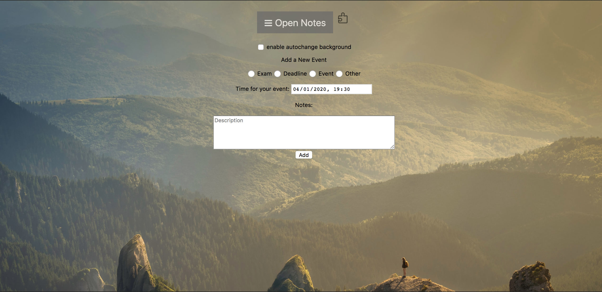

# GoogleExtension
This is a Google extension which helps people organize/prioritize their events. 

# Motivation
This project is for HoosHack 2020. Google extension is super easy to use.

# Screenshot
Open in a new tab:

Open from extension popup:

Add events:

Change background:
click for manually change, and check the box for auto change.

# Installation
After downloading the code, upload it in Google extension page after turning on developer mode. 

# Credits
Pictures from Unsplash, an open source website.

